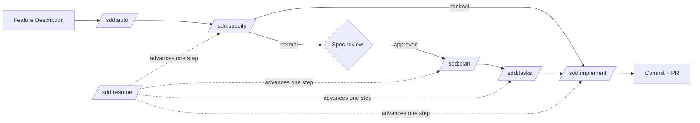
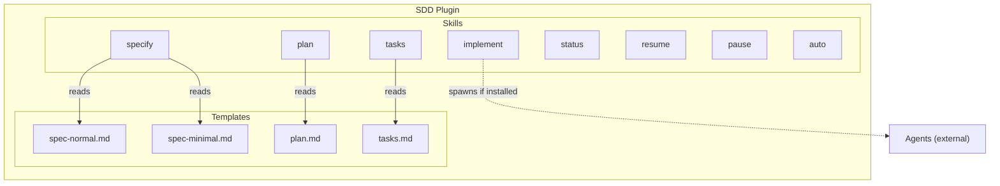
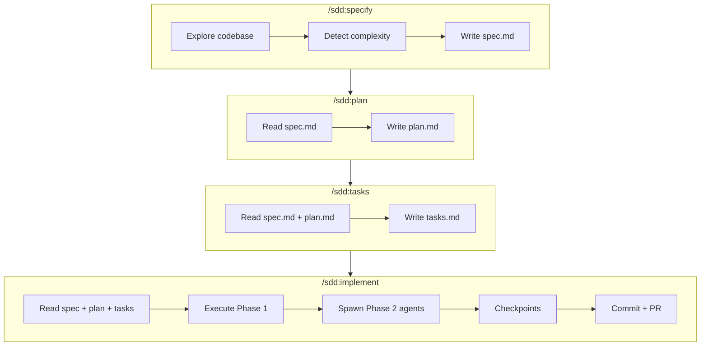
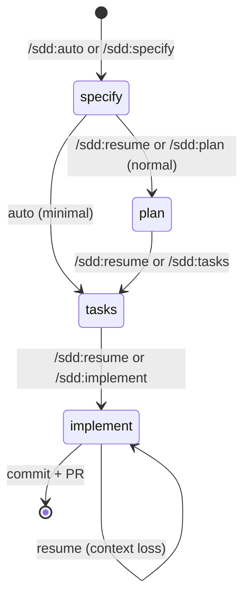

# Architecture

How SDD is built internally.

## High-Level Workflow



## Building Blocks



### Skills

Each skill is a standalone command defined in `skills/{name}/SKILL.md`. Skills load templates from `lib/templates/` and fill placeholders.

| Skill | Purpose | Reads | Writes |
|-------|---------|-------|--------|
| specify | Create spec from description | Codebase files | spec.md, .spec-context.json (+ plan.md, tasks.md if minimal) |
| plan | Design implementation approach | spec.md | plan.md, .spec-context.json |
| tasks | Generate phased task list | spec.md, plan.md | tasks.md, .spec-context.json |
| implement | Execute tasks, checkpoint, commit | spec.md, plan.md, tasks.md | Source code, .spec-context.json, commit + PR |
| status | Show dashboard | All .spec-context.json files | (display only) |
| resume | Advance one pipeline step (clears pause) | .spec-context.json, spec artifacts | Invokes next skill |
| pause | Pause a spec to prevent auto-advance | .spec-context.json | Sets paused flag |
| auto | Run full pipeline automatically | $ARGUMENTS (feature description) | Invokes specify, then loops resume |

### Templates

Templates live in `lib/templates/` and are the single source of truth. Skills reference them instead of inlining.

| Template | Used by | Variables |
|----------|---------|-----------|
| `spec-normal.md` | specify (normal mode) | `{Feature Name}`, `{NNN}-{slug}`, `{TODAY}` |
| `spec-minimal.md` | specify (minimal mode) | `{Feature Name}`, `{NNN}-{slug}`, `{TODAY}` |
| `plan.md` | plan, specify (minimal) | `{Feature Name}`, `{TODAY}` |
| `tasks.md` | tasks, specify (minimal) | `{Feature Name}`, `{TODAY}` |

See `lib/templates/README.md` for the canonical variable set.

### Shared Instructions

Cross-cutting logic lives in `lib/instructions/` as prose-driven instruction files that skills reference via a `## Shared Instructions` block:

| File | Used by | Purpose |
|------|---------|---------|
| `transition-logging.md` | all skills | Append an entry to `.spec-context.json#transitions` on every write |
| `hook-execution.md` | plan, implement | Execute `.sdd.json` `hooks` entries at supported pipeline points (10 hook points, 3 payload types) |
| `branch-creation.md` | specify, implement | Optional auto branch creation driven by `.sdd.json` `branchStage` |

Each instruction file is the single source of truth for its behavior. Skills call into them by name (e.g., "per [hook-execution]"), keeping the skill prose thin.

## Data Flow



## State Machine



### .spec-context.json

The runtime state file written per spec. **Field reference, lifecycle, write rules, substep enumeration, and the formal JSON Schema all live in [`docs/STATE.md`](./STATE.md)** — that document is the single source of truth. This section only covers how the file fits into SDD's data flow.

Skills read `.spec-context.json` on entry to recover context (especially after a context-loss restart) and write it after every meaningful action so the next invocation can resume from exactly the right place. Every write appends to the `transitions[]` audit log per [`lib/instructions/transition-logging.md`](../lib/instructions/transition-logging.md). The optional SpecKit Companion VS Code extension is the second author — it owns `status` and `stepHistory` and may append to `transitions[]`.

A short example:

```json
{
  "workflow": "sdd",
  "currentStep": "implement",
  "currentTask": "T003",
  "progress": "phase1",
  "next": null,
  "specName": "JWT Auth Middleware",
  "approach": "Adding JWT auth middleware to Express routes, RS256 signing",
  "files_modified": ["src/middleware/auth.ts", "src/routes/api.ts"],
  "last_action": "T003 complete — added route guards to all /api/* endpoints",
  "transitions": [
    { "step": "specify", "substep": null, "from": null, "by": "sdd", "at": "2026-03-25T10:00:00.000Z" },
    { "step": "implement", "substep": "phase1", "from": { "step": "tasks", "substep": null }, "by": "sdd", "at": "2026-03-26T14:30:00.000Z" }
  ]
}
```

For the full field catalog (~28 fields across core state, summaries, extension-managed, transitions), substep enumeration per step, and write timing, see [`docs/STATE.md`](./STATE.md).

## Implement Detail


## File Tree

```
sdd/
├── .claude-plugin/
│   ├── plugin.json          # Plugin metadata + version
│   └── marketplace.json     # Marketplace listing
├── skills/
│   ├── specify/SKILL.md     # Step 1: spec from description
│   ├── plan/SKILL.md        # Step 2: implementation design
│   ├── tasks/SKILL.md       # Step 3: phased task list
│   ├── implement/SKILL.md   # Step 4: execute + commit + PR
│   ├── status/SKILL.md      # Utility: dashboard
│   ├── resume/SKILL.md      # Orchestration: advance one step (clears pause)
│   ├── pause/SKILL.md       # Orchestration: pause a spec
│   └── auto/SKILL.md        # Orchestration: full pipeline
├── lib/templates/
│   ├── README.md            # Template variable reference
│   ├── spec-normal.md       # Full spec template
│   ├── spec-minimal.md      # Minimal spec template
│   ├── plan.md              # Plan template
│   └── tasks.md             # Tasks template
├── docs/
│   ├── ARCHITECTURE.md      # This file
│   ├── STATE.md             # .spec-context.json schema reference
│   └── CONFIGURATION.md     # .sdd.json reference
├── lib/schemas/
│   └── spec-context.schema.json   # Machine-readable schema for .spec-context.json
└── specs/                   # Generated specs
    └── {NNN}-{slug}/
        ├── spec.md
        ├── plan.md
        ├── tasks.md
        └── .spec-context.json
```
