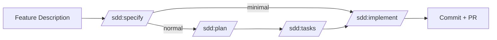
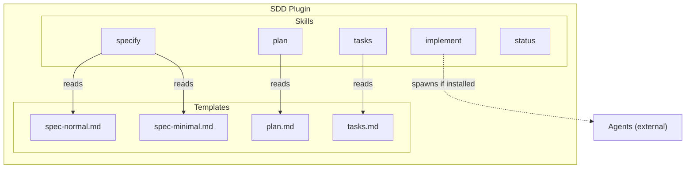
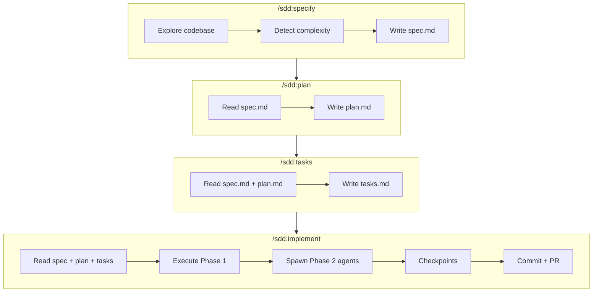
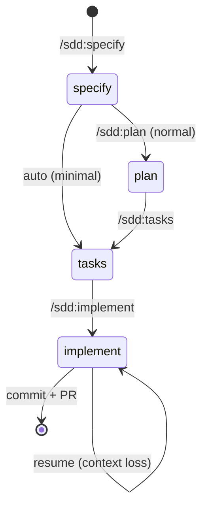
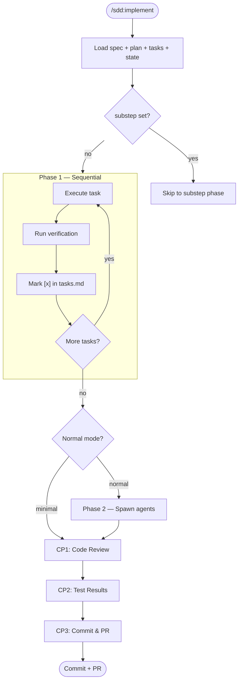

# Architecture

How SDD is built internally.

## High-Level Workflow



## Building Blocks



### Skills

Each skill is a standalone command defined in `skills/{name}/SKILL.md`. Skills load templates from `lib/templates/` and fill placeholders.

| Skill | Purpose | Reads | Writes |
|-------|---------|-------|--------|
| specify | Create spec from description | Codebase files | spec.md, state.json (+ plan.md, tasks.md if minimal) |
| plan | Design implementation approach | spec.md | plan.md, state.json |
| tasks | Generate phased task list | spec.md, plan.md | tasks.md, state.json |
| implement | Execute tasks, checkpoint, commit | spec.md, plan.md, tasks.md | Source code, state.json, commit + PR |
| status | Show dashboard | All state.json files | (display only) |

### Templates

Templates live in `lib/templates/` and are the single source of truth. Skills reference them instead of inlining.

| Template | Used by | Variables |
|----------|---------|-----------|
| `spec-normal.md` | specify (normal mode) | `{Feature Name}`, `{NNN}-{slug}`, `{TODAY}` |
| `spec-minimal.md` | specify (minimal mode) | `{Feature Name}`, `{NNN}-{slug}`, `{TODAY}` |
| `plan.md` | plan, specify (minimal) | `{Feature Name}`, `{TODAY}` |
| `tasks.md` | tasks, specify (minimal) | `{Feature Name}`, `{TODAY}` |

See `lib/templates/README.md` for the canonical variable set.

## Data Flow



## State Machine



### state.json

```json
{
  "step": "implement",
  "task": "T003",
  "substep": "code-review",
  "updated": "2026-03-26"
}
```

| Field | Values | Purpose |
|-------|--------|---------|
| `step` | specify, plan, tasks, implement | Current workflow phase |
| `task` | T001–T00N or null | Current task during implement |
| `substep` | See below or null | Granular position for precise recovery |
| `updated` | YYYY-MM-DD | Last modification date |

### Substep Values

On resume, the skill reads `substep` and skips completed phases.

#### specify

| Substep | Description |
|---------|-------------|
| `parsing` | Extracting feature description, generating slug |
| `exploring` | Reading codebase files to understand the feature area |
| `detecting` | Classifying complexity (minimal vs normal) |
| `writing-spec` | Generating spec.md (and plan.md + tasks.md if minimal) |

#### plan

| Substep | Description |
|---------|-------------|
| `loading` | Reading spec.md and state.json |
| `writing-plan` | Generating plan.md with approach, files, risks |

#### tasks

| Substep | Description |
|---------|-------------|
| `loading` | Reading spec.md and plan.md |
| `writing-tasks` | Generating tasks.md with phased task list |

#### implement

| Substep | Description |
|---------|-------------|
| `phase1` | Executing sequential core tasks (T001 → T002 → ...) |
| `phase2` | Spawning parallel agents for quality tasks |
| `code-review` | **CP1** — Reviewing changes, verifying scenarios, listing silent fixes |
| `test-results` | **CP2** — Reviewing test pass/fail status |
| `commit-review` | **CP3** — Reviewing commit message and PR body |
| `commit` | Staging files and creating git commit |
| `push` | Pushing branch to remote |
| `pr` | Creating pull request via `gh pr create` |

## Implement Detail



## File Tree

```
sdd/
├── .claude-plugin/
│   ├── plugin.json          # Plugin metadata + version
│   └── marketplace.json     # Marketplace listing
├── skills/
│   ├── specify/SKILL.md     # Step 1: spec from description
│   ├── plan/SKILL.md        # Step 2: implementation design
│   ├── tasks/SKILL.md       # Step 3: phased task list
│   ├── implement/SKILL.md   # Step 4: execute + commit + PR
│   └── status/SKILL.md      # Utility: dashboard
├── lib/templates/
│   ├── README.md            # Template variable reference
│   ├── spec-normal.md       # Full spec template
│   ├── spec-minimal.md      # Minimal spec template
│   ├── plan.md              # Plan template
│   └── tasks.md             # Tasks template
├── docs/
│   ├── ARCHITECTURE.md      # This file
│   └── CONFIGURATION.md     # .sdd.json reference
└── specs/                   # Generated specs
    └── {NNN}-{slug}/
        ├── spec.md
        ├── plan.md
        ├── tasks.md
        └── state.json
```
