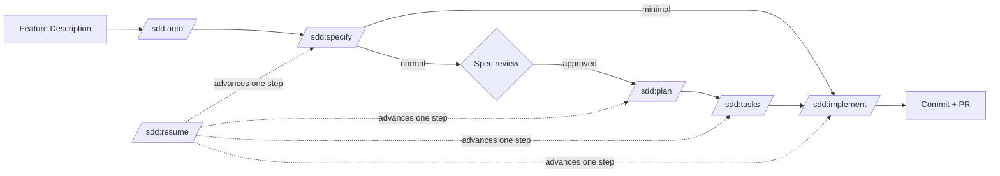
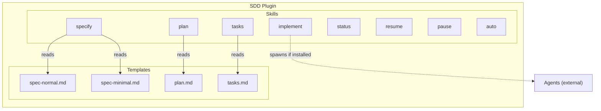
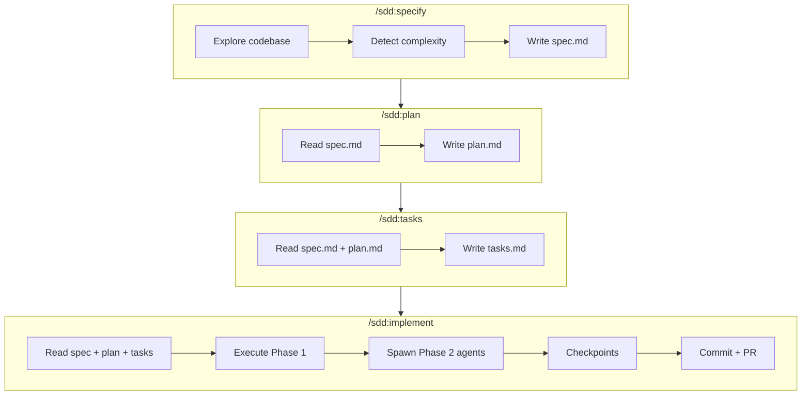
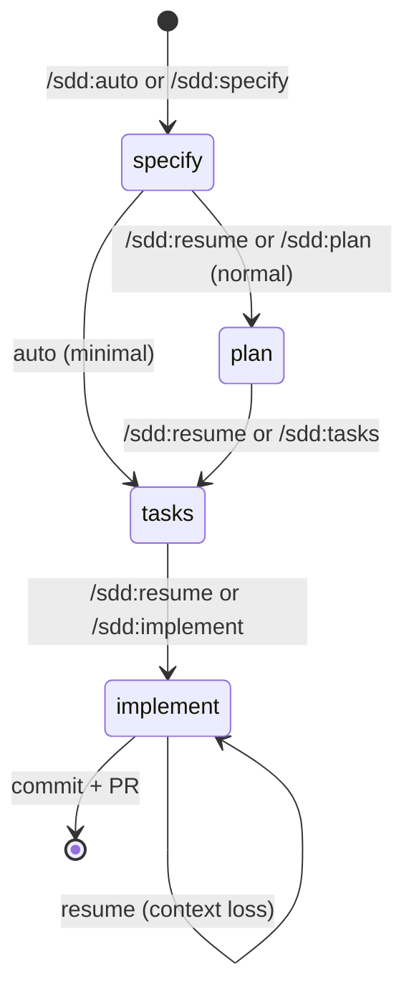
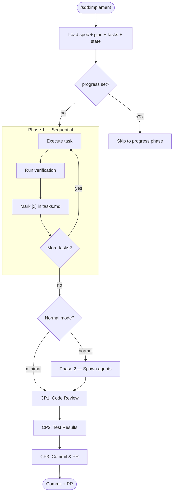

# Architecture

How SDD is built internally.

## High-Level Workflow



## Building Blocks



### Skills

Each skill is a standalone command defined in `skills/{name}/SKILL.md`. Skills load templates from `lib/templates/` and fill placeholders.

| Skill | Purpose | Reads | Writes |
|-------|---------|-------|--------|
| specify | Create spec from description | Codebase files | spec.md, .spec-context.json (+ plan.md, tasks.md if minimal) |
| plan | Design implementation approach | spec.md | plan.md, .spec-context.json |
| tasks | Generate phased task list | spec.md, plan.md | tasks.md, .spec-context.json |
| implement | Execute tasks, checkpoint, commit | spec.md, plan.md, tasks.md | Source code, .spec-context.json, commit + PR |
| status | Show dashboard | All .spec-context.json files | (display only) |
| resume | Advance one pipeline step (clears pause) | .spec-context.json, spec artifacts | Invokes next skill |
| pause | Pause a spec to prevent auto-advance | .spec-context.json | Sets paused flag |
| auto | Run full pipeline automatically | $ARGUMENTS (feature description) | Invokes specify, then loops resume |

### Templates

Templates live in `lib/templates/` and are the single source of truth. Skills reference them instead of inlining.

| Template | Used by | Variables |
|----------|---------|-----------|
| `spec-normal.md` | specify (normal mode) | `{Feature Name}`, `{NNN}-{slug}`, `{TODAY}` |
| `spec-minimal.md` | specify (minimal mode) | `{Feature Name}`, `{NNN}-{slug}`, `{TODAY}` |
| `plan.md` | plan, specify (minimal) | `{Feature Name}`, `{TODAY}` |
| `tasks.md` | tasks, specify (minimal) | `{Feature Name}`, `{TODAY}` |

See `lib/templates/README.md` for the canonical variable set.

## Data Flow



## State Machine



### .spec-context.json

```json
{
  "workflow": "sdd",
  "currentStep": "implement",
  "currentTask": "T003",
  "progress": "phase1",
  "next": null,
  "updated": "2026-03-26",
  "specName": "JWT Auth Middleware",
  "branch": "feat/jwt-auth",
  "selectedAt": "2026-03-25T10:00:00.000Z",
  "createdAt": "2026-03-25T10:00:00.000Z",
  "approach": "Adding JWT auth middleware to Express routes, RS256 signing",
  "decisions": [
    "JWT over session tokens (spec R002 requires stateless auth)",
    "Middleware pattern over route-level checks (matches existing logging middleware)"
  ],
  "concerns": [
    { "task": "T002", "note": "Type workaround in auth.ts:45 — TokenPayload cast" }
  ],
  "files_modified": [
    "src/middleware/auth.ts",
    "src/routes/api.ts",
    "src/types/auth.d.ts"
  ],
  "last_action": "T003 complete — added route guards to all /api/* endpoints",
  "step_summaries": {
    "specify": {
      "complexity": "normal",
      "requirements": 5,
      "scenarios": 3,
      "key_finding": "Existing logging middleware provides the pattern to follow"
    },
    "plan": {
      "approach_summary": "JWT middleware + route guards, 6 files, 2 risks identified",
      "files_planned": 6,
      "risks": ["Token refresh flow not covered in spec", "Rate limiting interaction unclear"]
    }
  },
  "task_summaries": {
    "T001": {
      "status": "DONE",
      "did": "Created auth middleware with JWT verification and role extraction",
      "files": ["src/middleware/auth.ts", "src/types/auth.d.ts"],
      "concerns": []
    },
    "T002": {
      "status": "DONE_WITH_CONCERNS",
      "did": "Wired middleware into route definitions, added role-based guards",
      "files": ["src/routes/api.ts", "src/middleware/auth.ts"],
      "concerns": ["Type workaround in auth.ts:45 — TokenPayload cast needs upstream fix"]
    }
  }
}
```

#### Core Fields

| Field | Type | Written By | Description |
|-------|------|-----------|-------------|
| `workflow` | string | specify | Workflow name, always `"sdd"` |
| `currentStep` | string | All skills | Current workflow phase: specify, plan, tasks, implement |
| `currentTask` | string \| null | implement | Current task ID (T001–T00N) during implement, null otherwise |
| `progress` | string \| null | All skills | Granular position within a step for precise recovery (see Progress Values below) |
| `next` | string \| null | All skills | Next step for `/sdd:resume`: plan, tasks, implement, done, or null. SDD-specific field. |
| `updated` | string | All skills | Last modification date (YYYY-MM-DD). SDD-specific field. |
| `specName` | string | specify | Human-readable feature name |
| `branch` | string | specify | Git branch associated with this spec |
| `selectedAt` | string | specify | ISO timestamp when workflow was selected |
| `createdAt` | string | specify | ISO timestamp when spec was created |
| `auto` | boolean | auto | `true` when running via `/sdd:auto`, `false` otherwise. Skills read this to suppress manual next-step hints and show `🔄 Auto mode — continuing...` instead. |

#### Context Fields

| Field | Type | Written By | Description |
|-------|------|-----------|-------------|
| `approach` | string | plan, implement | One-line implementation strategy. Written by plan on completion. Updated by implement if approach drifts. |
| `decisions` | string[] | implement | Key decisions made during execution. Each entry is a short statement with rationale. Appended per task. |
| `concerns` | {task, note}[] | implement | Flagged issues. Each has `task` (which task raised it) and `note` (what the concern is). Surfaced at CP1. |
| `files_modified` | string[] | implement | Deduplicated list of all files actually changed. Updated after each task completes. |
| `last_action` | string | implement | What just happened. Updated after each task for quick resume context. |
| `step_summaries` | object | specify, plan | Per-step summary written when each step completes. |
| `step_summaries.specify` | object | specify | `{ complexity, requirements, scenarios, key_finding }` |
| `step_summaries.plan` | object | plan | `{ approach_summary, files_planned, risks }` |
| `task_summaries` | object | implement | Per-task summary keyed by task ID, written when each task completes. |
| `task_summaries.{id}` | object | implement | `{ status, did, files, concerns }` — status is DONE or DONE_WITH_CONCERNS |

#### Extension-Managed Fields

These fields are written by SpecKit Companion (the VS Code extension). SDD skills should preserve them when writing — always read-then-merge, never overwrite the whole file.

| Field | Type | Written By | Description |
|-------|------|-----------|-------------|
| `status` | string | Extension | Spec status for sidebar grouping: `"active"`, `"completed"`, or `"archived"` |
| `stepHistory` | object | Extension | Step progress with timestamps. Each key is a step name. |
| `stepHistory.{step}` | object | Extension | `{ startedAt: ISO string, completedAt: ISO string \| null }` |

Note: `workflow`, `selectedAt`, `currentStep`, `specName`, `branch`, `createdAt`, and `checkpointStatus` are now written by SDD skills (see Core Fields above). The extension also reads/writes these fields.

#### Write Timing

- **specify creates**: writes `workflow`, `selectedAt`, `specName`, `branch`, `createdAt`
- **specify completes**: writes `step_summaries.specify` with complexity, requirement count, scenario count, key finding
- **plan completes**: writes `step_summaries.plan` with approach summary, file count, risks. Writes top-level `approach`.
- **Each implement task completes**: writes `task_summaries.{taskId}`, updates `files_modified`, appends to `decisions` and `concerns` if applicable, updates `last_action`
- **implement ships**: writes `checkpointStatus` with commit/PR status
- **On resume**: implement reads `approach`, `last_action`, `task_summaries` to reconstruct context without full artifact re-read

### Progress Values

On resume, the skill reads `progress` and skips completed phases.

#### specify

| Progress | Description |
|---------|-------------|
| `parsing` | Extracting feature description, generating slug |
| `exploring` | Reading codebase files to understand the feature area |
| `detecting` | Classifying complexity (minimal vs normal) |
| `writing-spec` | Generating spec.md (and plan.md + tasks.md if minimal) |

#### plan

| Progress | Description |
|---------|-------------|
| `loading` | Reading spec.md and .spec-context.json |
| `writing-plan` | Generating plan.md with approach, files, risks |

#### tasks

| Progress | Description |
|---------|-------------|
| `loading` | Reading spec.md and plan.md |
| `writing-tasks` | Generating tasks.md with phased task list |

#### implement

| Progress | Description |
|---------|-------------|
| `phase1` | Executing sequential core tasks (T001 → T002 → ...) |
| `phase2` | Spawning parallel agents for quality tasks |
| `code-review` | **CP1** — Reviewing changes, verifying scenarios, listing silent fixes |
| `test-results` | **CP2** — Reviewing test pass/fail status |
| `commit-review` | **CP3** — Reviewing commit message and PR body |
| `commit` | Staging files and creating git commit |
| `push` | Pushing branch to remote |
| `pr` | Creating pull request via `gh pr create` |

## Implement Detail



## File Tree

```
sdd/
├── .claude-plugin/
│   ├── plugin.json          # Plugin metadata + version
│   └── marketplace.json     # Marketplace listing
├── skills/
│   ├── specify/SKILL.md     # Step 1: spec from description
│   ├── plan/SKILL.md        # Step 2: implementation design
│   ├── tasks/SKILL.md       # Step 3: phased task list
│   ├── implement/SKILL.md   # Step 4: execute + commit + PR
│   ├── status/SKILL.md      # Utility: dashboard
│   ├── resume/SKILL.md      # Orchestration: advance one step (clears pause)
│   ├── pause/SKILL.md       # Orchestration: pause a spec
│   └── auto/SKILL.md        # Orchestration: full pipeline
├── lib/templates/
│   ├── README.md            # Template variable reference
│   ├── spec-normal.md       # Full spec template
│   ├── spec-minimal.md      # Minimal spec template
│   ├── plan.md              # Plan template
│   └── tasks.md             # Tasks template
├── docs/
│   ├── ARCHITECTURE.md      # This file
│   └── CONFIGURATION.md     # .sdd.json reference
└── specs/                   # Generated specs
    └── {NNN}-{slug}/
        ├── spec.md
        ├── plan.md
        ├── tasks.md
        └── .spec-context.json
```
