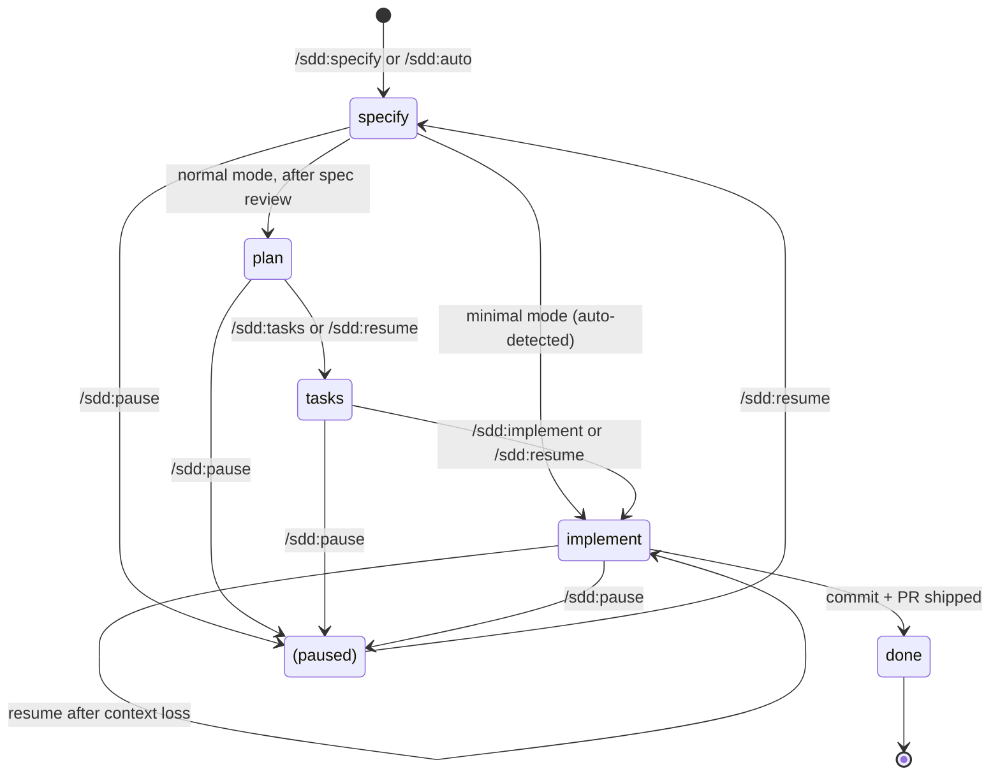

# State Model: `.spec-context.json`

> Canonical reference for the SDD runtime state file.
> Machine-readable schema: [`lib/schemas/spec-context.schema.json`](../lib/schemas/spec-context.schema.json).

This document is the single source of truth for the shape, lifecycle, and write rules of `.spec-context.json`. Other docs (`CLAUDE.md`, `docs/ARCHITECTURE.md`, individual `SKILL.md` files) link here rather than restating field tables.

## Overview

Every spec directory contains one `.spec-context.json` at `specs/{NNN}-{slug}/.spec-context.json`. It records:

- **Where the workflow is**: `currentStep`, `currentTask`, `progress`, `next`
- **What was decided**: `approach`, `decisions`, `concerns`
- **What got done**: `files_modified`, `last_action`, `step_summaries`, `task_summaries`
- **Audit trail**: `transitions[]`, `createdAt`, `selectedAt`, `branch`, `prUrl`, `prNumber`
- **Extension-managed UI state**: `status`, `stepHistory`

Skills read it on entry to recover context and write it after every meaningful action so the next invocation can pick up exactly where the previous one left off.

## Authors

Two authors write to `.spec-context.json`:

| Author | Identifier in `transitions[].by` | Owns |
|---|---|---|
| **SDD skills** (this repo) | `"sdd"` | Core state, summaries, audit trail, transitions, intent. |
| **SpecKit Companion** (optional VS Code extension) | `"extension"` | `status`, `stepHistory`. May also append to `transitions[]` for UI-driven state changes. |

Both authors must follow the [Multi-Author Write Rules](#multi-author-write-rules) below.

## State Machine



`currentStep` follows this graph. `paused` is an orthogonal flag — when `paused: true`, no skill auto-advances regardless of `next`.

## Field Reference

Fields are grouped by purpose. The full machine-readable contract is in [`lib/schemas/spec-context.schema.json`](../lib/schemas/spec-context.schema.json).

### Core State

These fields drive `/sdd:resume`, `/sdd:auto`, and skill-entry recovery.

| Field | Type | Author | Description |
|---|---|---|---|
| `workflow` | const `"sdd"` | sdd | Workflow identifier. Set once at creation. |
| `currentStep` | enum `specify·plan·tasks·implement·done` | sdd, extension | The active phase. Updated on every transition. |
| `currentTask` | `T###` \| null | sdd | Active task during `/sdd:implement` Phase 1; null elsewhere. |
| `progress` | string \| null | sdd | Substep within `currentStep`. See [Substep Enumeration](#substep-enumeration). |
| `next` | enum `plan·tasks·implement·done` \| null | sdd | Hint to the next skill in the pipeline. |
| `auto` | boolean | sdd | True while `/sdd:auto` is driving. Cleared on completion. |
| `paused` | boolean | sdd | Set by `/sdd:pause`; cleared by `/sdd:resume`. Blocks auto-advance. |
| `updated` | YYYY-MM-DD | sdd | Bumped on every write. |

### Identity / Audit Trail

Set once at creation and (mostly) immutable.

| Field | Type | Author | Description |
|---|---|---|---|
| `specName` | string | sdd | Human-readable feature name. |
| `branch` | string | sdd | Git branch the user was on when `/sdd:specify` ran. Audit trail — never updated. |
| `workingBranch` | string \| null | sdd | Branch SDD actually runs on. Populated when `branchStage` auto-creates one. |
| `type` | enum `feat·fix·refactor·docs·chore` | sdd | Conventional-commit type inferred at specify. Used by branch / commit generators. |
| `selectedAt` | ISO datetime | sdd | When `/sdd:specify` selected this workflow. |
| `createdAt` | ISO datetime | sdd | When the spec dir was created. |

### Summaries (rolling state)

Updated as work progresses; read at resume to skip re-deriving context.

| Field | Type | Author | Description |
|---|---|---|---|
| `approach` | string \| null | sdd (plan, implement) | One-line strategy. Plan writes it on completion; implement may update if it drifts. |
| `decisions` | string[] | sdd (implement) | Append-only log of non-trivial choices made during implement. |
| `concerns` | `{task, note}[]` | sdd (implement) | Issues flagged during tasks. Surfaced at CP1. |
| `files_modified` | string[] | sdd (implement) | Deduplicated union of files touched. Updated after each task. |
| `last_action` | string \| null | sdd (implement) | One-line summary of the most recent action. |

### Step Summaries

Per-step structured summaries. Skills read these instead of re-parsing artifacts on resume.

| Path | Type | Written By | Description |
|---|---|---|---|
| `step_summaries.specify` | object | sdd (specify) | `{ complexity, requirements, scenarios, key_finding }` |
| `step_summaries.specify.complexity` | enum `minimal·normal` | sdd | Detected mode. |
| `step_summaries.specify.requirements` | integer | sdd | R### count in spec.md. |
| `step_summaries.specify.scenarios` | integer | sdd | Scenario heading count. |
| `step_summaries.specify.key_finding` | string | sdd | One-line observation about the codebase pattern most relevant to implementation. |
| `step_summaries.plan` | object | sdd (plan) | `{ files_planned, risks }` |
| `step_summaries.plan.files_planned` | integer | sdd | File count in plan.md Create + Modify tables. |
| `step_summaries.plan.risks` | string[] | sdd | Risks listed in plan.md `## Risks`. Empty array if no risks. |

> `step_summaries.plan.approach_summary` is **deprecated** — it duplicated the top-level `approach` field. Validators warn when present; skills strip on next rewrite.

### Task Summaries

| Path | Type | Written By | Description |
|---|---|---|---|
| `task_summaries.{T###}` | object | sdd (implement) | `{ status, did, files, concerns }` keyed by task ID. |
| `task_summaries.{T###}.status` | enum `DONE·DONE_WITH_CONCERNS` | sdd | Per-task outcome. |
| `task_summaries.{T###}.did` | string | sdd | One-line summary of what the task actually did. |
| `task_summaries.{T###}.files` | string[] | sdd | Files this task modified. |
| `task_summaries.{T###}.concerns` | string[] | sdd | Per-task concern strings; mirrored into top-level `concerns[]`. |

### Ship / Checkpoint

Written by `/sdd:implement` Steps 8 and 8b.

| Field | Type | Author | Description |
|---|---|---|---|
| `checkpointStatus` | `{commit, pr}` | sdd | Tracks which ship gates have completed. |
| `prUrl` | URI | sdd | URL returned by `gh pr create`. |
| `prNumber` | integer | sdd | PR number from `gh pr create`. |

### Extension-Managed

Written by SpecKit Companion. SDD skills must preserve via read-then-merge.

| Field | Type | Author | Description |
|---|---|---|---|
| `status` | enum `active·completed·archived` | extension, sdd (on ship) | Lifecycle field used for tree grouping. Distinct from `currentStep`. SDD writes `"completed"` on ship; extension writes on step transitions. Last-writer-wins. |
| `stepHistory` | `{ {step}: { startedAt, completedAt } }` | extension | Per-step timing for UI display. |

### Transitions Log

```json
{
  "transitions": [
    { "step": "specify", "substep": "parsing", "from": null, "by": "sdd", "at": "2026-05-03T16:47:32Z" },
    { "step": "specify", "substep": "exploring", "from": { "step": "specify", "substep": "parsing" }, "by": "sdd", "at": "2026-05-03T16:48:00Z" }
  ]
}
```

| Path | Type | Author | Description |
|---|---|---|---|
| `transitions` | array | sdd, extension | Append-only audit log. |
| `transitions[].step` | enum step | sdd, extension | Step at write time. |
| `transitions[].substep` | string \| null | sdd, extension | Substep at write time. SDD writes match `progress`. |
| `transitions[].from` | `{step, substep}` \| null | sdd, extension | Prior `currentStep` + `progress`. Null on first write. |
| `transitions[].by` | enum `sdd·extension` | self | Identifies the writer. |
| `transitions[].at` | ISO datetime | self | When this entry was appended. |

The full append-only / read-before-write rules live in [`lib/instructions/transition-logging.md`](../lib/instructions/transition-logging.md).

## Substep Enumeration

`progress` (and the matching `transitions[].substep`) take these values per step. SDD skills must use these names; the extension may add additional UI-specific substeps.

### specify

| Substep | When |
|---|---|
| `parsing` | Extracting feature description, generating slug |
| `exploring` | Reading codebase files for context |
| `detecting` | Classifying complexity (minimal vs normal) |
| `writing-spec` | Generating spec.md (and plan.md + tasks.md if minimal) |
| `writing-plan` | Generating plan.md (minimal mode only) |

### plan

| Substep | When |
|---|---|
| `loading` | Reading spec.md and `.spec-context.json` |
| `writing-plan` | Generating plan.md |

### tasks

| Substep | When |
|---|---|
| `loading` | Reading spec.md and plan.md |
| `writing-tasks` | Generating tasks.md |

### implement

| Substep | When |
|---|---|
| `phase1` | Executing core tasks (T001 → T002 → ...) |
| `phase2` | Spawning Phase 2 quality agents (legacy `agents` config; new specs use Phase 1 only) |
| `hooks` | Running configured `.sdd.json` hooks |
| `code-review` | CP1 — reviewing changes, verifying scenarios |
| `test-results` | CP2 — reviewing test pass/fail |
| `commit-review` | CP3 — reviewing commit message and PR body |
| `commit` | Staging files and creating the git commit |
| `push` | Pushing the branch to origin |
| `pr` | Creating the pull request via `gh pr create` |

### done

`progress` is null when `currentStep == "done"`.

## Multi-Author Write Rules

Both authors share the file. Three rules keep them safe:

### 1. Read-then-merge (never overwrite the whole file)

Before any write:

1. Read the existing `.spec-context.json` (handle empty / missing for first write).
2. Update only the fields your write owns.
3. Preserve all other fields verbatim — including unknown fields you don't recognize.
4. Write the merged result.

This is how SDD preserves extension-only fields like `stepHistory`, and how the extension preserves SDD's `step_summaries`. See [`lib/instructions/transition-logging.md`](../lib/instructions/transition-logging.md) for the canonical rule.

### 2. `transitions[]` is append-only

Never truncate, rewrite, or reorder existing entries. Always read the current array, capture the prior `currentStep` + `progress` as your `from`, append your new entry, write back. Every `.spec-context.json` write must append one transition entry.

### 3. Unknown fields are preserved

If your code reads a field it doesn't recognize, treat it as opaque and write it back unchanged. This protects forward compatibility — future versions of either author can introduce fields without breaking the other.

## Backward Compatibility

The schema is **lenient on read, strict on write**. Existing specs may carry legacy fields; validators warn rather than error.

### Deprecated fields

| Field | Reason | Action |
|---|---|---|
| `step_summaries.plan.approach_summary` | Duplicates top-level `approach` field — top-level is what implement reads at resume. | Validator warns when present. Skills strip on next rewrite. |

### Schema-version contract

There's no explicit `schemaVersion` field today — all fields are optional except those listed in the JSON Schema's `required` array (`workflow`, `currentStep`, `specName`, `createdAt`). Adding a new field is non-breaking; renaming or removing a field is breaking and requires a deprecation entry above before removal.

## Required vs. optional fields

These four fields must exist for a `.spec-context.json` to validate at all:

- `workflow` (always `"sdd"`)
- `currentStep`
- `specName`
- `createdAt`

Everything else is optional but appears predictably as the workflow advances. See [Write Timing](#write-timing) below.

## Write Timing

Approximate order of when fields appear:

| At | Fields written / updated |
|---|---|
| `/sdd:specify` start | `workflow`, `currentStep`, `specName`, `branch`, `type`, `createdAt`, `selectedAt`, `transitions[0]` |
| `/sdd:specify` complete | `step_summaries.specify`, `next`, `progress: null` |
| `/sdd:plan` complete | `approach`, `step_summaries.plan`, `next: "tasks"` |
| `/sdd:tasks` complete | `next: "implement"` |
| Each `/sdd:implement` task complete | `task_summaries.{T###}`, `files_modified`, `decisions[]`, `concerns[]`, `last_action`, `currentTask` |
| `/sdd:implement` ship | `checkpointStatus`, `currentStep: "done"`, `status: "completed"`, `prUrl`, `prNumber` |
| Any time | `transitions[]` is appended; `updated` is bumped |

## Validation

Use [`lib/scripts/validate-spec-context.py`](../lib/scripts/validate-spec-context.py) (added in PR #2 of this consolidation) to check any spec context against [`lib/schemas/spec-context.schema.json`](../lib/schemas/spec-context.schema.json):

```bash
python3 lib/scripts/validate-spec-context.py specs/020-tidy-templates/.spec-context.json
```

Exit codes: `0` valid · `1` schema violation · `2` warnings only.

## Where this doc gets referenced

- [`CLAUDE.md`](../CLAUDE.md) — points here from the Spec Directory section.
- [`docs/ARCHITECTURE.md`](./ARCHITECTURE.md) — points here from the Data Flow section.
- [`lib/instructions/transition-logging.md`](../lib/instructions/transition-logging.md) — points here for the broader schema; owns the transitions[] write rules.
- Individual `skills/*/SKILL.md` files — quote field names; this doc is authoritative.
