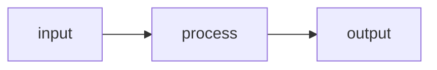

# Plan: {Feature Name}

<!-- Template variables: {Feature Name}, {TODAY}, {NNN}, {slug}, {NNN}-{slug} -->

**Spec**: [spec.md](./spec.md)

## Approach

[2–3 sentences: what we're building, the key architectural decision, and why that approach.]

## Technical Context

**Key Dependencies**: [only non-obvious ones — e.g., Zod, Express. Omit Stack: it's project-fixed and lives in CLAUDE.md.]
**Constraints**: [e.g., must work offline, <200ms response — omit if none]

## Architecture

<!-- Only if the feature touches 3+ components or has non-obvious data flow. Omit otherwise. -->

## Files

### Create

- `path/to/new-file` — [what it does]

### Modify

- `path/to/existing` — [what changes and why]

## Data Model

<!-- Only if the feature introduces or changes data structures. Omit otherwise. -->

- `Example` — fields: `field1, field2` — [new or existing, what changed]

## Testing Strategy

<!-- Only if the feature needs specific testing guidance beyond "run existing tests." Omit for trivial changes. -->

- **Unit**: [What to test, which framework]
- **Integration**: [What to test, approach]
- **Edge cases**: [Specific scenarios from spec to cover]

## Risks

<!-- Only if genuinely non-obvious risks exist. Omit section entirely otherwise. -->

- [Risk]: [Mitigation]
