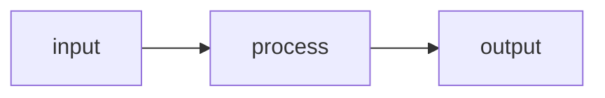

# Plan: {Feature Name}

<!-- Template variables: {Feature Name}, {TODAY}, {NNN}, {slug}, {NNN}-{slug} -->

**Spec**: [spec.md](./spec.md) | **Date**: {TODAY}

## Approach

[2–3 sentences: what we're building, the key architectural decision, and why that approach.]

## Technical Context

**Stack**: [e.g., TypeScript, Node 20, Vitest]
**Key Dependencies**: [e.g., Zod, Express — only non-obvious ones]
**Constraints**: [e.g., must work offline, <200ms response — omit if none]

## Flow

[Only if the feature touches 4+ files and data flow is non-obvious. Omit section otherwise.]

## Files

### Create

| File | Purpose |
|------|---------|
| `path/to/new-file` | [what it does] |

### Modify

| File | Change |
|------|--------|
| `path/to/existing` | [what changes and why] |

## Data Model

[Only if the feature introduces or changes data structures. Omit section otherwise.]

| Entity/Type | Fields / Shape | Notes |
|-------------|---------------|-------|
| `Example` | `field1, field2` | [new or existing — what changed] |

## Risks

[Only if genuinely non-obvious risks exist. Omit section entirely otherwise.]

- [Risk]: [Mitigation]
