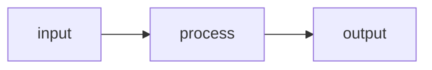

## Steps

### 1. Load Context

If `$ARGUMENTS` is provided, use `specs/{$ARGUMENTS}/` as the target directory.
Otherwise, find the most recently modified directory under `specs/` that contains a `spec.md`.

Read in parallel:
- `specs/{NNN}-{slug}/spec.md` — feature name, requirements, scenarios
- `specs/{NNN}-{slug}/state.json` — current step/task (if exists)

If no spec found, stop: "Run `/sdd:specify` first."

Update `specs/{NNN}-{slug}/state.json`:

```json
{ "step": "plan", "task": null, "updated": "{TODAY}" }
```

---

### 2. Write `specs/{NNN}-{slug}/plan.md`

```markdown
# Plan: {Feature Name}

**Spec**: [spec.md](./spec.md) | **Date**: {TODAY}

## Approach

[2–3 sentences: what we're building, the key architectural decision, and why that approach.]

## Technical Context

**Stack**: [e.g., TypeScript, Node 20, Vitest]
**Key Dependencies**: [e.g., Zod, Express — only non-obvious ones]
**Constraints**: [e.g., must work offline, <200ms response — omit if none]

## Flow

[Only if the feature touches 4+ files and data flow is non-obvious. Omit section otherwise.]



## Files

### Create

| File | Purpose |
|------|---------|
| `path/to/new-file` | [what it does] |

### Modify

| File | Change |
|------|--------|
| `path/to/existing` | [what changes and why] |

## Data Model

[Only if the feature introduces or changes data structures. Omit section otherwise.]

| Entity/Type | Fields / Shape | Notes |
|-------------|---------------|-------|
| `Example` | `field1, field2` | [new or existing — what changed] |

## Risks

[Only if genuinely non-obvious risks exist. Omit section entirely otherwise.]

- [Risk]: [Mitigation]
```

**Skip**: research.md, contracts/, quickstart.md, constitution checks, auxiliary work flags.
**Optional** (include when relevant): Technical Context, Data Model table, Mermaid flow diagram.

---

### 3. Summary

Display exactly this format:

```
--- Plan complete ---
Feature: {Feature Name}
Plan:    specs/{NNN}-{slug}/plan.md  —  {N} files to create, {N} to modify

Next: /sdd:tasks {NNN}-{slug}
```
