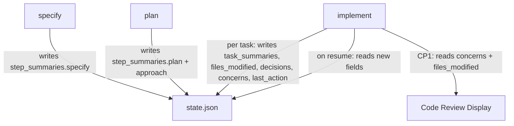

# Plan: Richer State Tracking

**Spec**: [spec.md](./spec.md) | **Date**: 2026-03-29

## Approach

Add structured context fields to state.json (approach, decisions, concerns, files_modified, last_action, step_summaries, task_summaries) and update each skill's SKILL.md to write these fields at the appropriate lifecycle points. The schema stays in a single state.json file (not separate files per step) to keep resume logic simple — one read reconstructs full context.

## Flow

## Files

### Modify

| File | Change |
|------|--------|
| `skills/specify/SKILL.md` | Add substep after writing spec.md/plan.md+tasks.md to write `step_summaries.specify` to state.json |
| `skills/plan/SKILL.md` | Add substep after writing plan.md to write `step_summaries.plan` and `approach` to state.json |
| `skills/implement/SKILL.md` | Add per-task state writes (task_summaries, files_modified, decisions, concerns, last_action); update resume logic to use new fields; enhance CP1 display with concerns and unplanned file flags |
| `docs/ARCHITECTURE.md` | Replace 4-field state.json docs with full enriched schema, field descriptions, write timing, and example |

## Data Model

| Entity/Type | Fields / Shape | Notes |
|-------------|---------------|-------|
| `step_summaries.specify` | `{ complexity, requirements, scenarios, key_finding }` | Written once when specify completes |
| `step_summaries.plan` | `{ approach_summary, files_planned, risks }` | Written once when plan completes |
| `task_summaries.{taskId}` | `{ status, did, files, concerns }` | Written per task; status is DONE or DONE_WITH_CONCERNS |
| `concerns[]` | `{ task, note }` | Top-level array, appended during implement |
| `decisions[]` | `string` | Top-level array, appended during implement |
| `files_modified[]` | `string` | Deduplicated union of all task files |
| `approach` | `string` | One-line summary, written by plan, updated by implement if it drifts |
| `last_action` | `string` | What just happened, updated after each task |

## Risks

- **Partial JSON writes**: If a skill crashes mid-write, state.json could be corrupted. Mitigation: skills write the full JSON atomically (single Write call), not incremental appends.
