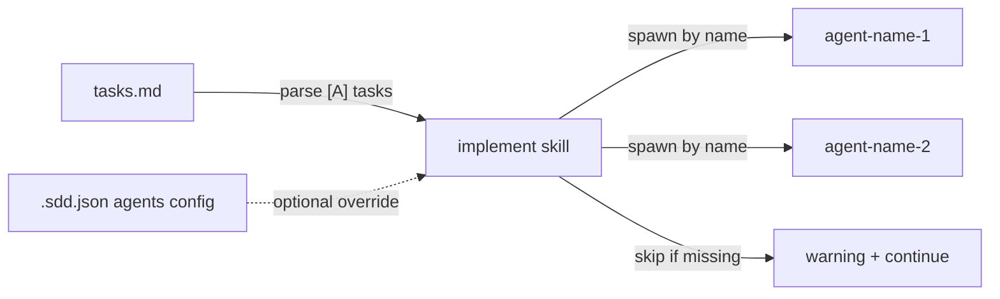

# Plan: Make Phase 2 Agent-Agnostic

**Spec**: [spec.md](./spec.md) | **Date**: 2026-03-26

## Approach

Rewrite implement's Phase 2 to read agent names from tasks.md `[A]` markers instead of hardcoding `test-expert` and `docs-expert`. The task format already includes the agent name (e.g., `— test-expert`). Implement parses this and spawns by name. Add optional `.sdd.json` `agents` config to override or disable agents.

## Technical Context

**Stack**: Markdown skill definitions, JSON config
**Constraints**: Depends on 004-extract-agents being done first (agents removed from repo). Claude Code agent spawning uses agent name — must match what's installed.

## Flow

## Data Model

| Entity/Type | Fields / Shape | Notes |
|-------------|---------------|-------|
| `.sdd.json` agents | `{ "agents": { "test-expert": { "enabled": true } } }` | Optional — override or disable agents |

## Files

### Create

_None_

### Modify

| File | Change |
|------|--------|
| `skills/implement/SKILL.md` | Rewrite Phase 2: parse `[A]` tasks for agent name, spawn by name, graceful skip if unavailable |
| `skills/tasks/SKILL.md` | Clarify in Phase 2 template that agent name after `—` is the spawned agent identifier |
| `docs/CONFIGURATION.md` | Document optional `agents` config in `.sdd.json` |
