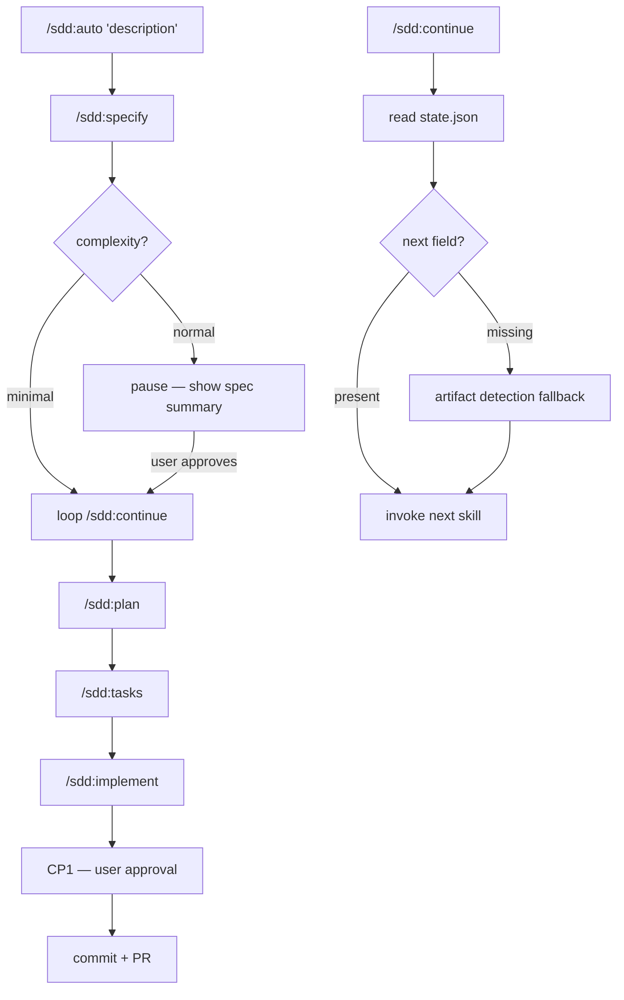

# Plan: Auto Mode

**Spec**: [spec.md](./spec.md) | **Date**: 2026-03-29

## Approach

Add a `next` field to every state.json write across the four existing skills, then create two new skills: `/sdd:continue` (reads state.json + artifact presence to advance one step) and `/sdd:auto` (runs specify then loops continue with a complexity gate). The approach keeps the architecture flat — no new orchestrator abstraction — by having `continue` simply invoke the appropriate existing skill and `auto` loop `continue`.

## Technical Context

**Stack**: Claude Code skills (Markdown-based prompt files)
**Key Dependencies**: existing state.json format, existing 5 skills
**Constraints**: skills are stateless prompts — all persistence is via state.json and spec artifacts on disk

## Flow

## Files

### Create

| File | Purpose |
|------|---------|
| `skills/continue/SKILL.md` | `/sdd:continue` skill — reads state.json, determines next step, invokes it |
| `skills/auto/SKILL.md` | `/sdd:auto` skill — runs specify, applies complexity gate, loops continue |

### Modify

| File | Change |
|------|--------|
| `skills/specify/SKILL.md` | Add `next` field to state.json writes in Steps 2, 6, and 7 |
| `skills/plan/SKILL.md` | Add `next: "tasks"` to state.json write in Step 3 |
| `skills/tasks/SKILL.md` | Add `next: "implement"` to state.json write in Step 3 |
| `skills/implement/SKILL.md` | Add `next: "done"` to state.json write in Step 9 |
| `CLAUDE.md` | Add `next` to state.json format, add `/sdd:continue` and `/sdd:auto` to workflow section |

## Data Model

| Entity/Type | Fields / Shape | Notes |
|-------------|---------------|-------|
| `state.json` | add `"next": "plan" \| "tasks" \| "implement" \| "done" \| null` | new field — existing fields unchanged |

## Risks

- **Skill invocation from within a skill**: `/sdd:continue` and `/sdd:auto` need to call other skills (plan, tasks, implement). Claude Code skills can invoke other skills via the Skill tool — this is the mechanism used. If Skill tool is unavailable, the skill falls back to printing the next command for the user to run manually.
