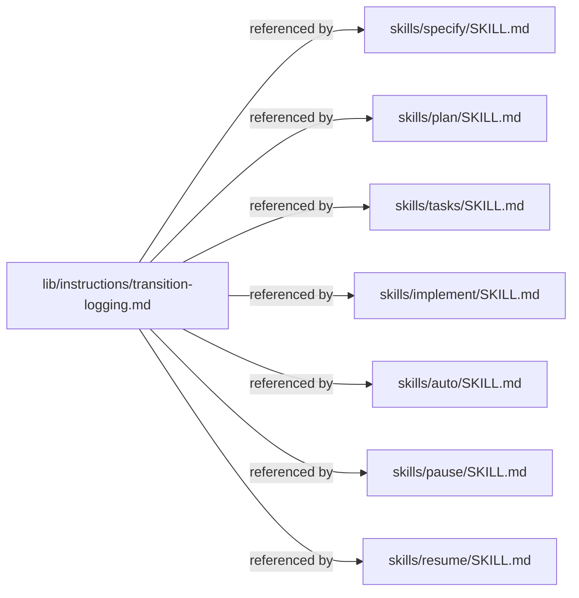

# Plan: Add Transition Logging

**Spec**: [spec.md](./spec.md) | **Date**: 2026-04-09

## Approach

Create a shared instruction snippet (`lib/instructions/transition-logging.md`) that defines the transition-logging pattern, then include a reference to it from each of the 7 skill SKILL.md files that write `.spec-context.json` (status only reads, so it's excluded). Each skill's existing `.spec-context.json` write steps get a small addition: read previous state first, then append a transition entry to the `transitions` array during the write. The shared snippet keeps the format and rules DRY.

## Technical Context

**Stack**: Markdown skill prompts (no runtime code — all logic lives in SKILL.md instructions)
**Key Dependencies**: None — skills are prompt-based, executed by Claude Code
**Constraints**: Must be purely additive; no changes to existing field values or workflow logic

## Architecture

## Files

### Create

- `lib/instructions/transition-logging.md` — shared instruction snippet defining the transition entry format, append-only rule, and read-before-write requirement

### Modify

- `skills/specify/SKILL.md` — add reference to shared snippet; update `.spec-context.json` write steps to append transitions (first write uses `from: null`)
- `skills/plan/SKILL.md` — add reference to shared snippet; update `.spec-context.json` write steps to append transitions
- `skills/tasks/SKILL.md` — add reference to shared snippet; update `.spec-context.json` write steps to append transitions
- `skills/implement/SKILL.md` — add reference to shared snippet; update `.spec-context.json` write steps to append transitions (multiple writes per task)
- `skills/auto/SKILL.md` — add reference to shared snippet; update `.spec-context.json` write steps to append transitions
- `skills/pause/SKILL.md` — add reference to shared snippet; update `.spec-context.json` write steps to append transitions
- `skills/resume/SKILL.md` — add reference to shared snippet; update `.spec-context.json` write steps to append transitions

## Data Model

- `transitions` — new top-level array in `.spec-context.json`, append-only. Each entry:
  - `step` (string) — current step at time of write
  - `substep` (string|null) — current substep/progress at time of write
  - `from` (object|null) — `{ "step": string, "substep": string|null }` capturing previous state; `null` on first write
  - `by` (string) — always `"sdd"`
  - `at` (string) — ISO 8601 timestamp

## Risks

- **Skill prompt size growth**: Each SKILL.md gains a small reference line plus minor additions to write steps. Mitigated by keeping the shared snippet concise and only adding a one-line reference per skill.
- **Missed write site in implement**: Implement has many incremental `.spec-context.json` updates (per-task, checkpoints). Must audit all write sites carefully. Mitigated by task-level review during implementation.
